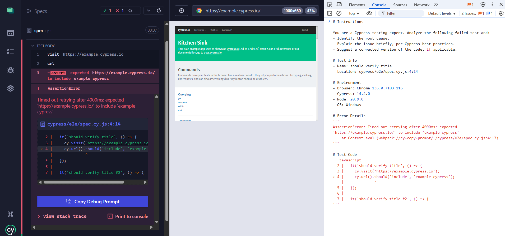

# cy-copy-prompt



Cypress copy prompt plugin for helping to debug tests

## Installation

```bash
npm install --save-dev cy-copy-prompt
```

## Usage

You need to import the plugin in your Cypress `e2e` file (usually `cypress/support/e2e.js`):

```typescript
import 'cy-copy-prompt';
```

or

```javascript
require('cy-copy-prompt');
```

## License

This project is licensed under the MIT License - see the [LICENSE](LICENSE) file for details.

## Author

[Yevhen Laichenkov](elaichenkov@gmail.com)